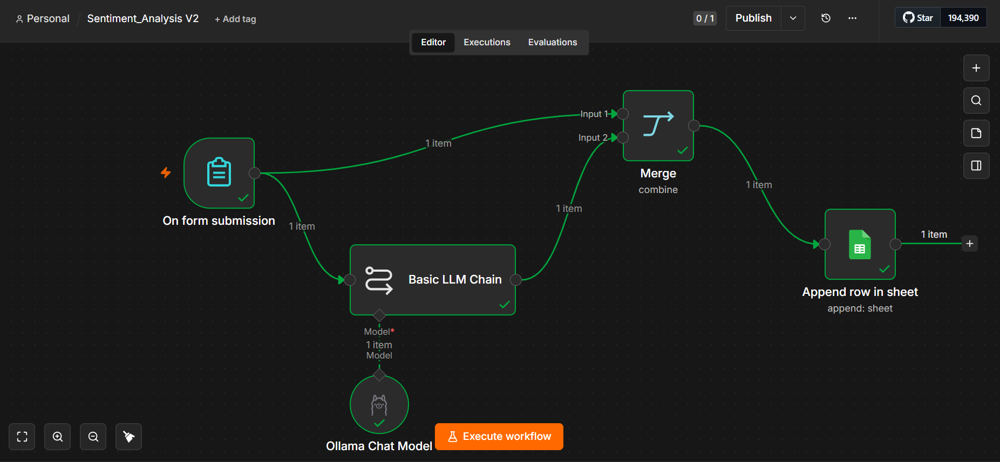

# 🤖 AI-Powered Sentiment Analysis Automation



An end-to-end AI automation workflow built with **n8n** and an **LLM (Ollama)** to analyze customer feedback. The workflow classifies each review as **Positive**, **Negative**, or **Neutral**, then automatically stores the customer's name, feedback, and sentiment in an Excel sheet for future reporting and data analysis.

---

## 🚀 Features

- Collects customer name and feedback through a form
- Performs AI-powered sentiment analysis using an LLM
- Returns a single-word sentiment:
  - ✅ Positive
  - ⚪ Neutral
  - ❌ Negative
- Automatically stores the results in an Excel sheet
- Creates structured data ready for dashboards, reporting, and analytics
- Fully automated using n8n workflows

---

## ⚙️ Workflow

1. Customer submits their name and feedback.
2. n8n sends the feedback to the LLM (Ollama).
3. The model classifies the sentiment.
4. The workflow merges the customer data with the AI response.
5. The customer's name, feedback, and sentiment are automatically appended to an Excel sheet.

---

## 🛠️ Tech Stack

- n8n
- Ollama
- Large Language Model (LLM)
- Excel
- AI Automation

---

## 📊 Example Output

| Customer | Feedback | Sentiment |
|----------|----------|-----------|
| Ahmed | The service was amazing! | Positive |
| Sara | It was okay. | Neutral |
| Omar | I'm disappointed with the experience. | Negative |

---

## 📁 Repository Structure

```
.
├── workflow.json
├── screenshot.png
└── README.md
```

## 👨‍💻 Author

**Moataz Nageh**

AI & Data Science | Machine Learning | AI Automation | n8n
